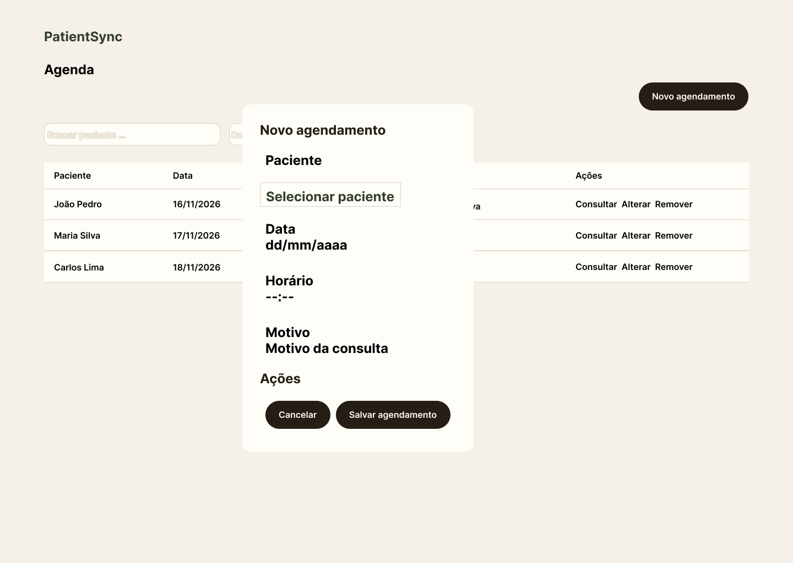
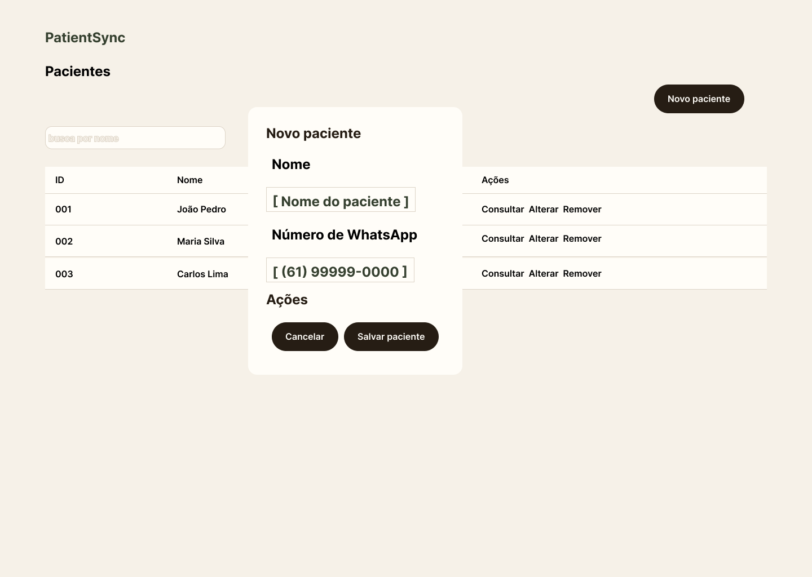

Cole este conteúdo inteiro no `README.md`. Mantive apenas informações e decisões que vocês já definiram; onde a implementação ainda não existe, deixei isso explícito em vez de inventar comandos, versões ou URLs.

```markdown
# PatientSync


**Instituição:** CEUB  
**Curso:** Ciência da Computação  
**Disciplina:** Desenvolvimento Web  
**Turma / Semestre:** Turma A / 4º semestre  
**Professor:** Felippe Pires Ferreira  
**Status do projeto:** Fase 1 — documentação e arquitetura

---

## Sumário

- [1. Descrição do projeto](#1-descrição-do-projeto)
- [2. Funcionalidades](#2-funcionalidades)
- [3. Protótipos](#3-protótipos)
- [4. Tecnologias](#4-tecnologias)
- [5. Arquitetura](#5-arquitetura)
- [6. API REST](#6-api-rest)
- [7. Integrações externas](#7-integrações-externas)
- [8. Modelo de dados](#8-modelo-de-dados)
- [9. Organização dos diretórios](#9-organização-dos-diretórios)
- [10. Participantes](#10-participantes)
- [11. Como executar](#11-como-executar)
- [12. Configuração](#12-configuração)
- [13. Testes](#13-testes)
- [14. Uso de inteligência artificial](#14-uso-de-inteligência-artificial)
- [15. Planejamento](#15-planejamento)
- [16. Documentação](#16-documentação)

---

## 1. Descrição do projeto

O PatientSync é uma aplicação web destinada a profissionais de clínica.

O projeto busca reduzir os blocos vazios de tempo causados por pacientes que esquecem de comparecer às consultas ou de cancelar seus agendamentos.

O profissional ou assistente registra os pacientes e agendamentos pelo sistema. Os agendamentos são sincronizados com o Apple Calendar, e o paciente recebe um lembrete pelo WhatsApp 24 horas antes da consulta, com possibilidade de cancelamento.

### Objetivo geral

Tornar o processo de agendamento mais eficiente e reduzir os blocos vazios de tempo causados pelo esquecimento do paciente em comparecer ou cancelar a consulta.

### Público-alvo

- Profissionais de clínica.
- Assistentes responsáveis pelo gerenciamento dos agendamentos.

---

## 2. Funcionalidades

| Funcionalidade | Descrição | Status |
| --- | --- | --- |
| Cadastro de pacientes | Registrar e manter dados dos pacientes | Planejada |
| Cadastro de agendamentos | Registrar os agendamentos realizados pelo profissional | Planejada |
| Consulta de agendamentos | Visualizar e pesquisar agendamentos | Planejada |
| Alteração de agendamentos | Alterar informações de um agendamento existente | Planejada |
| Remoção de agendamentos | Remover agendamentos cadastrados | Planejada |
| Busca de pacientes | Buscar pacientes pelo nome | Planejada |
| Busca de agendamentos | Buscar por paciente e filtrar por data | Planejada |
| Lembretes por WhatsApp | Enviar lembrete 24 horas antes da consulta | Planejada |
| Cancelamento pelo WhatsApp | Receber a ação de cancelamento do paciente | Planejada |
| Apple Calendar | Sincronizar agendamentos com o calendário do profissional | Planejada |
| API REST própria | Disponibilizar pacientes e agendamentos para clientes externos | Planejada |
| Relatório | Gerar relatório do sistema | Planejada |

---

## 3. Protótipos

Foram produzidos dois protótipos essenciais para a aplicação:

### Agenda



A tela permite visualizar os agendamentos, pesquisar por paciente, filtrar por data e acessar as ações de registro, consulta, alteração e remoção.

### Pacientes



A tela permite visualizar os pacientes, pesquisar por nome e acessar as ações de registro, consulta, alteração e remoção.

### Identidade visual


O arquivo editável dos protótipos está disponível em:

`docs/prototipos/patientsync-prototipos.fig`

---

## 4. Tecnologias

| Camada / finalidade | Tecnologia |
| --- | --- |
| Linguagem | Python |
| Backend | Django |
| Banco de dados | SQLite |
| API própria | REST |
| WhatsApp | Twilio WhatsApp API |
| Calendário | iCloud Calendar via CalDAV |
| Prototipação | Figma |
| Modelagem de dados | Astah |
| Versionamento | Git e GitHub |

As versões específicas das dependências serão definidas durante a implementação da Fase 2.

---

## 5. Arquitetura

O profissional utiliza uma interface web para registrar e gerenciar os agendamentos.

As ações realizadas na interface são enviadas ao backend Django, responsável pela lógica do sistema, acesso ao banco de dados e coordenação das integrações externas.

Fluxo principal:

```text
Interface Web
      |
      v
Backend Django
   |       |        |
   v       v        v
SQLite   Twilio   iCloud Calendar
                  via CalDAV
```

O SQLite será utilizado para armazenar os dados do sistema.

A Twilio WhatsApp API será utilizada para enviar lembretes e receber cancelamentos.

O iCloud Calendar será acessado através de CalDAV para sincronizar os agendamentos do profissional.

Documentação completa:

- [Arquitetura](docs/arquitetura/arquitetura.md)
- [Diagrama de arquitetura](docs/arquitetura/diagrama-arquitetura.pdf)

---

## 6. API REST

A API própria do PatientSync disponibilizará os recursos:

- Pacientes
- Agendamentos

### Endpoints principais

#### Pacientes

| Método | Endpoint | Ação |
| --- | --- | --- |
| `GET` | `/api/pacientes/` | Listar pacientes |
| `GET` | `/api/pacientes/{id}/` | Consultar paciente |
| `POST` | `/api/pacientes/` | Criar paciente |
| `PUT/PATCH` | `/api/pacientes/{id}/` | Alterar paciente |
| `DELETE` | `/api/pacientes/{id}/` | Remover paciente |

#### Agendamentos

| Método | Endpoint | Ação |
| --- | --- | --- |
| `GET` | `/api/agendamentos/` | Listar agendamentos |
| `GET` | `/api/agendamentos/{id}/` | Consultar agendamento |
| `POST` | `/api/agendamentos/` | Criar agendamento |
| `PUT/PATCH` | `/api/agendamentos/{id}/` | Alterar agendamento |
| `DELETE` | `/api/agendamentos/{id}/` | Remover agendamento |

A API será protegida por autenticação por token.

Contrato completo:

[docs/api/contrato-api.md](docs/api/contrato-api.md)

---

## 7. Integrações externas

### Twilio WhatsApp API

A principal API externa do PatientSync será a Twilio WhatsApp API.

Ela será utilizada para:

- enviar o lembrete ao paciente 24 horas antes da consulta;
- receber a ação de cancelamento realizada pelo paciente;
- encaminhar a resposta para um webhook do PatientSync.

Webhook previsto:

```text
POST /webhooks/twilio/whatsapp/
```

As credenciais serão armazenadas em variáveis de ambiente e não serão versionadas no GitHub.

### Apple Calendar

A sincronização com o Apple Calendar será realizada através do iCloud Calendar utilizando CalDAV.

Serão sincronizados:

- nome do paciente;
- data;
- horário.

Ao registrar, alterar ou remover um agendamento, o evento correspondente deverá ser criado, atualizado ou removido do calendário.

Plano completo:

[docs/api/integracao-externa.md](docs/api/integracao-externa.md)

---

## 8. Modelo de dados

O modelo inicial possui duas entidades principais:

### Paciente

- `id_paciente`
- `nome`
- `numero_contato`

### Agendamento

- `id_agendamento`
- `paciente_id`
- `data`
- `horario`
- `motivo`
- `status`

Um paciente pode possuir vários agendamentos, enquanto cada agendamento pertence a um único paciente.

Arquivos:

- [Modelo de dados — PNG](docs/modelagem/banco-de-dados/modelo-dados.png)
- `docs/modelagem/banco-de-dados/modelo-dados.asta`

---

## 9. Organização dos diretórios

```text
.
├── README.md
├── docs/
│   ├── api/
│   │   ├── contrato-api.md
│   │   └── integracao-externa.md
│   │
│   ├── arquitetura/
│   │   ├── arquitetura.md
│   │   ├── diagrama-arquitetura.fig
│   │   └── diagrama-arquitetura.pdf
│   │
│   ├── modelagem/
│   │   ├── banco-de-dados/
│   │   │   ├── modelo-dados.asta
│   │   │   └── modelo-dados.png
│   │   │
│   │   └── casos-de-uso/
│   │       ├── diagrama-casos-de-uso.fig
│   │       ├── diagrama-casos-de-uso.pdf
│   │       └── especificacoes-casos-de-uso.md
│   │
│   ├── planejamento/
│   │   └── planejamento.md
│   │
│   ├── prototipos/
│   │   ├── agenda.png
│   │   ├── pacientes.png
│   │   ├── foundation-board.png
│   │   └── patientsync-prototipos.fig
│   │
│   └── visao/
│       └── visao.md
│
└── images/
```

---

## 10. Participantes

| Nome | Matrícula | Responsabilidades previstas |
| --- | --- | --- |
| Lucas Diógenes Landim Vasques | RA: 22553040 | Frontend, integrações externas, publicação, SAST e DAST |
| Nicolas Veiga de Vasconcelos | RA: 22402421 | Banco de dados, API REST própria e testes |
| Matheus — dados completos pendentes | Pendente | Backend Django e relatório |

A apresentação final será realizada por Lucas, Nicolas e Matheus.

**Professor responsável:** Felippe Pires Ferreira

---

## 11. Como executar

A aplicação ainda não foi implementada.

As instruções completas de instalação e execução serão adicionadas durante a Fase 2, após a criação do projeto Django e definição das dependências necessárias.

---

## 12. Configuração

As credenciais e segredos do sistema deverão ser fornecidos por variáveis de ambiente e não poderão ser adicionados ao GitHub.

Entre as integrações previstas estão:

```text
Twilio:
- API Key SID
- API Key Secret

iCloud Calendar:
- credencial específica de app
```

Os nomes definitivos das variáveis de ambiente serão definidos durante a implementação.

---

## 13. Testes

Os testes serão desenvolvidos na Fase 2.

O planejamento prevê:

- testes das funcionalidades principais;
- testes da API REST;
- análise SAST;
- análise DAST.

As ferramentas, comandos e resultados serão documentados após a implementação.

---

## 14. Uso de inteligência artificial

Este projeto segue as regras de uso de inteligência artificial definidas pela disciplina.

### Declaração de uso

**Houve uso de IA neste projeto?** Sim.

**Ferramenta utilizada:** ChatGPT.

**Finalidade:** apoio pontual para esclarecimento de conceitos, revisão gramatical e de formatação, verificação de consistência e suporte operacional durante a organização dos artefatos.

As decisões sobre problema, escopo, funcionalidades, casos de uso, arquitetura, modelo de dados, API, integrações, protótipos e planejamento foram discutidas e definidas pelos integrantes do projeto.

---

## 15. Planejamento

O planejamento da Fase 2 inclui:

1. Desenvolver o frontend das telas.
2. Desenvolver o backend em Django.
3. Desenvolver o banco de dados.
4. Integrar com as APIs externas.
5. Implementar a API REST própria.
6. Implementar o relatório.
7. Realizar testes das funcionalidades e da API.
8. Publicar/hospedar a aplicação.
9. Realizar as análises SAST e DAST.
10. Preparar a apresentação final.

Planejamento completo:

[docs/planejamento/planejamento.md](docs/planejamento/planejamento.md)

---

## 16. Documentação

### Visão

- [Documento de Visão](docs/visao/visao.md)

### Casos de uso

- [Especificações dos casos de uso](docs/modelagem/casos-de-uso/especificacoes-casos-de-uso.md)
- [Diagrama de casos de uso](docs/modelagem/casos-de-uso/diagrama-casos-de-uso.pdf)
- Arquivo editável: `docs/modelagem/casos-de-uso/diagrama-casos-de-uso.fig`

### Arquitetura

- [Descrição da arquitetura](docs/arquitetura/arquitetura.md)
- [Diagrama de arquitetura](docs/arquitetura/diagrama-arquitetura.pdf)
- Arquivo editável: `docs/arquitetura/diagrama-arquitetura.fig`

### Modelo de dados

- [Modelo de dados](docs/modelagem/banco-de-dados/modelo-dados.png)
- Arquivo editável: `docs/modelagem/banco-de-dados/modelo-dados.asta`

### APIs

- [Contrato inicial da API REST](docs/api/contrato-api.md)
- [Plano de integração externa](docs/api/integracao-externa.md)

### Protótipos e identidade

- [Agenda](docs/prototipos/agenda.png)
- [Pacientes](docs/prototipos/pacientes.png)
- [Foundation Board](docs/prototipos/foundation-board.png)
- Arquivo editável: `docs/prototipos/patientsync-prototipos.fig`

### Planejamento

- [Planejamento da Fase 2](docs/planejamento/planejamento.md)

---

## Licença

Projeto desenvolvido para fins acadêmicos na disciplina de Desenvolvimento Web do CEUB.
```